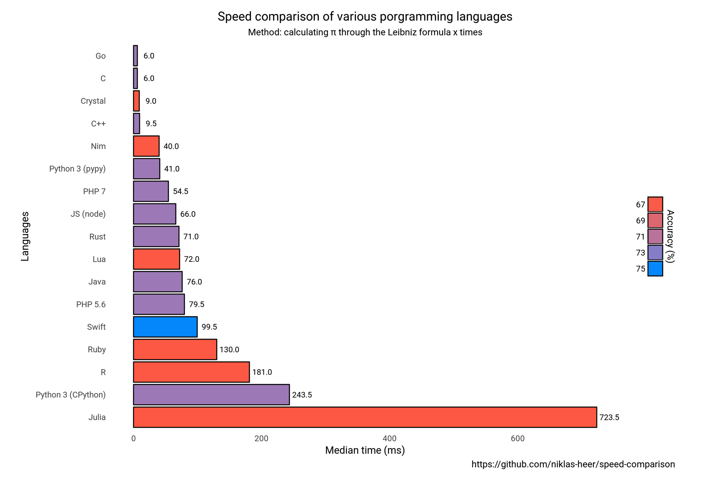

{}
On présente ci-dessous une brève introduction au langage C avec quelques exemples de codes, et une recension des librairies scientifiques utiles en modélisation numérique.
{}

Un des attraits importants des langages compilés (tels C et C++) par rapport aux langages interprétés (tel Python) vient de leur vitesse d’exécution.

Voici un bref comparatif:



Le principal désavantage de ce type de langage est toutefois l’offre beaucoup moins importante de librairies scientifiques (pas de `numpy` ici) et la syntaxe parfois plus complexe que celle des langages plus "haut niveau".

Le langage C possède par ailleurs plusieurs versions (C11, C17) et une extension orientée-objet -- le C++.

Finalement, on peut interfacer du code C et du code Python via [Cython](https://cython.org).

## Exemple introductif

Un code C de type "hello world" pourrait ressembler à:

```C
#include <stdio.h>
int main() {
   // printf() displays the string inside quotation
   printf("Hello, World!");
   return 0;
}
```

En plaçant ce code dans le fichier `hello.c`, on peut compiler avec

```shell
gcc hello.c -o hello
```

ce qui produit l’exécutable `hello`.

## Librairies scientifiques

### GNU Scientific Library (GSL)

La [GSL](https://www.gnu.org/software/gsl/) est l’une des principales libraires de calcul scientifique en C. Bref aperçu des fonctionnalités:

* Complex Numbers
* Roots of Polynomials
* Special Functions
* Vectors and Matrices
* Permutations
* Sorting
* BLAS Support
* Linear Algebra
* Eigensystems
* Fast Fourier Transforms
* Quadrature
* Random Numbers
* Quasi-Random Sequences
* Random Distributions
* Statistics
* Histograms
* N-Tuples
* Monte Carlo Integration
* Simulated Annealing
* Differential Equations
* Interpolation
* Numerical Differentiation
* Chebyshev Approximation
* Series Acceleration
* Discrete Hankel Transforms
* Root-Finding
* Minimization
* Least-Squares Fitting
* Physical Constants
* IEEE Floating-Point
* Discrete Wavelet Transforms
* Basis splines
* Running Statistics
* Sparse Matrices and Linear Algebra
