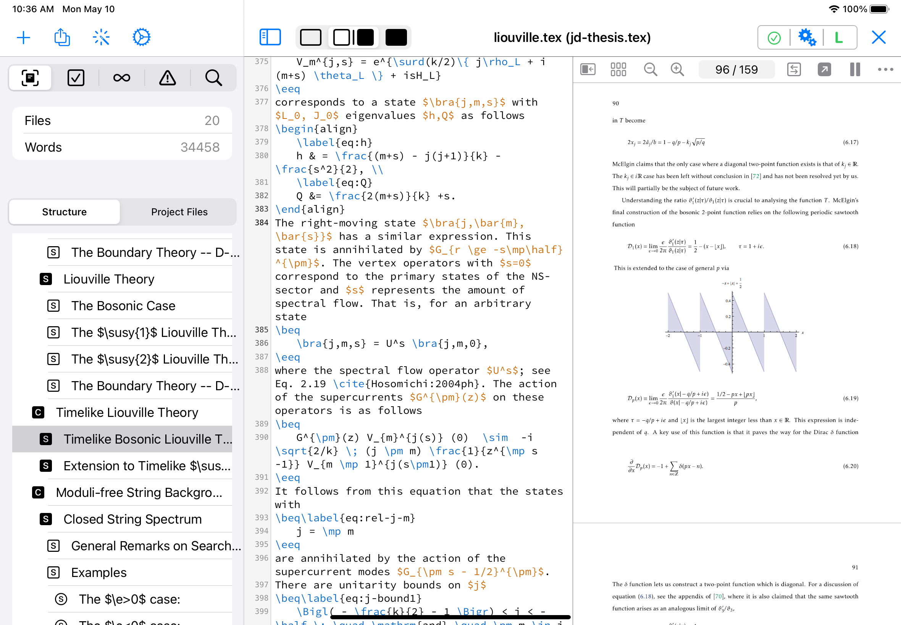
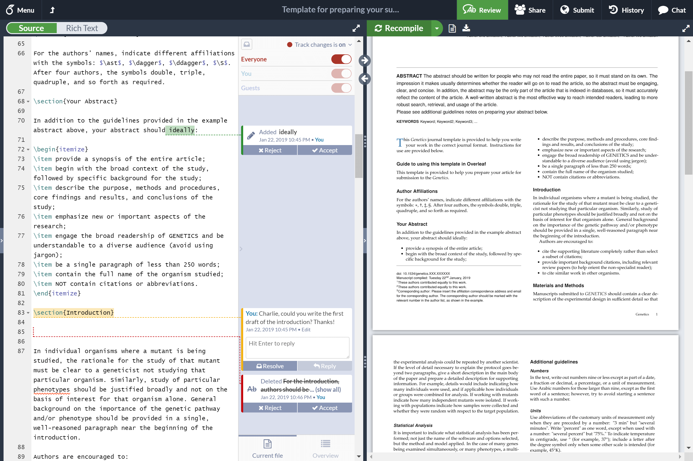

{}
On présente dans cette page quelques informations utiles pour le langage latex -- notamment les packages de gestion bibliographique, et quelques éditeurs utiles.
{}

J’imagine que rendu ici vous êtes tout à fait familiers avec le langage latex, donc je ne vais y consigner que des éléments plus avancés.

## Gestion bibliographique

> Quelques formats/packages de gestion bibliographique pour latex.

### bibtex

[Bibtex](https://www.bibtex.com) est l’un des plus vieux format de gestion bibliographique sous latex. On l’utilise avec le package `natbib`. Plusieurs journaux nécessitent l’entrée de citations avec `natbib`.

### biblatex

Plus récent que `bibtex`, le format [BibLatex](https://ctan.org/pkg/biblatex?lang=en) (et le package du même nom) possèdent de nombreuses fonctionnalités avancées que `bibtex` ne fournit pas, par exemple imprimer (facilement...) des entrées bibliographiques dans le texte, etc.

## Éditeurs

> Quelques éditeurs, tant spécifiques au latex que généraux.

### texpad

[Texpad](https://www.texpad.com) est un éditeur macOS relativement bien conçu qui a deux avantages plutôt pratiques selon moi:

* complétion automatique (ou suggestions) lorsqu’on cite, car il lit les fichiers de bibliographie
* prévisualisation en temps réel du document -- ce qui en fait un outil bien pratique pour rédiger rapidement de petits documents (e.g. lettres, etc.)[^1]

[^1]: À noter que Texpad utilise son outil de compilation interne qui peut ne pas être compatible avec tous les packages latex, et qui peut devenir moins pratique pour les documents plus lourds.

### Overleaf

[Overleaf](https://www.overleaf.com) est un service en ligne qui permet de créer des documents latex et de les visualiser directement dans le fureteur. Se connecte optionnellement avec d’autres services (e.g. Github) ce qui peut être pratique. Possède également des fonctionnalités de collaboration entre auteurs.

### emacs

[emacs](../../outils/terminal#emacs) peut évidemment servir à éditer des documents latex, et possède par ailleurs certaines extensions destinées précisément à ça ([auctex](https://www.gnu.org/software/auctex/), par exemple).
