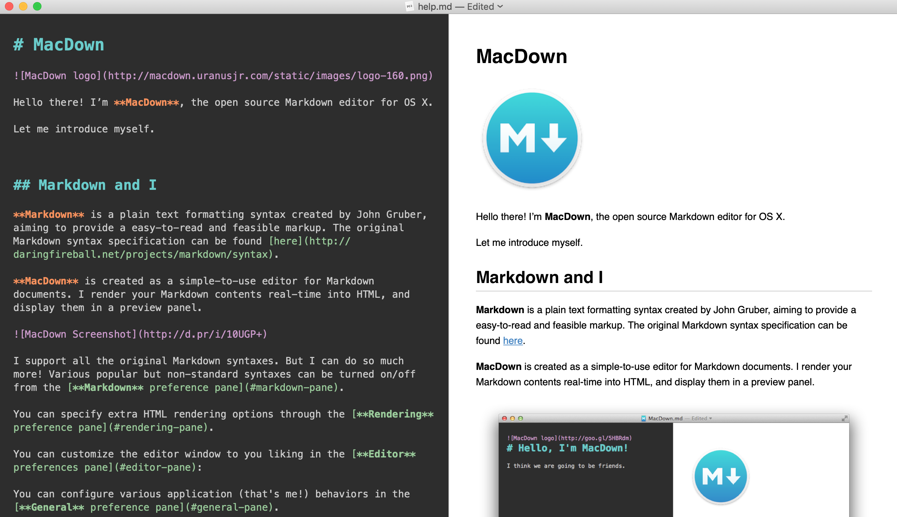

{}
On présente ci-dessous une brève introduction au langage Markdown, incluant quelques éditeurs et la syntaxe de base du langage.
{}

Le langage Markdown est une sorte de version très **très** simplifiée de latex, qui permet de créer des documents simples comportant certains éléments de mise en forme. Le site web que vous lisez présentement utilise une variation du langage Markdown.

Il est très utile pour prendre des notes de manière plus informelle qu’avec latex, mais peut également être utilisé pour produire des documents PDF. On peut aussi y entrer des équations, ajouter des images, etc.

## Éditeurs

> Quelques éditeurs pouvant être utilisés pour le Markdown.

### MacDown

[MacDown](https://macdown.uranusjr.com) est un éditeur open source sous macOS qui permet de créer rapidement des documents Markdown et de les prévisualiser.

<figure>

<figcaption>Macdown.</figcaption>
</figure>

### emacs

Comme pour [l’édition de documents latex](../latex#emacs), emacs est un autre éditeur très pratique pour l’édition de documents Markdown -- à ceci près qu’il ne possède pas de fonction de prévisualisation comme e.g. MacDown.

### Obsidian

[Obsidian](../../recherche/gestion-information#obsidian) est basé sur une certaine variation du langage Markdown, et peut être tout à fait utile pour entrer des notes dans ce langage. Moins pratique pour l’édition de fichiers individuels toutefois.

## Syntaxe de base

> Syntaxe de base commune à virtuellement toutes les implémentations de Markdown.

On insère les titres en sous-titres via
```
# Titre
## Sous-titre
### Sous-sous-titre
```

Le texte peut être formatté selon:

|Syntaxe|Résultat|
|-|-|
|`**bonjour**`|**gras**|
|`*bonjour*`|*bonjour*|
|`~~bonjour~~`|~~bonjour~~|
|`[un lien](www.google.com)`|[un lien](www.google.com)|
|```$$x^2$$```|$$x^2$$|

### Blocs de code

On peut insérer des blocs de code via

```markdown
```bonjour```
```

ce qui donne

```
bonjour
```

### Citations

On peut également insérer des citations via

```markdown
> bonjour
```

ce qui donne

> bonjour

### Images

On insère des images en utilisant du code HTML, qui est plus pratique que le code Markdown pour inclure les images (et ne permet pas de les redimensionner):

```markdown

```

Résultat:


