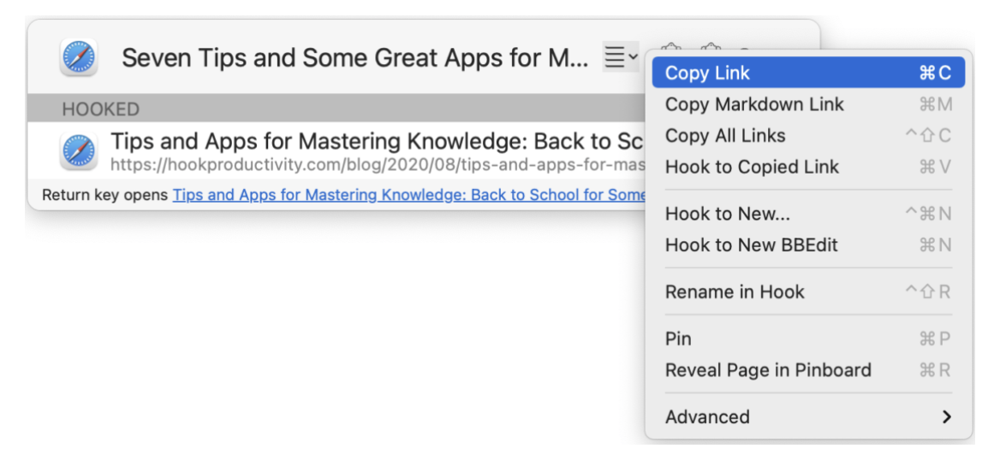
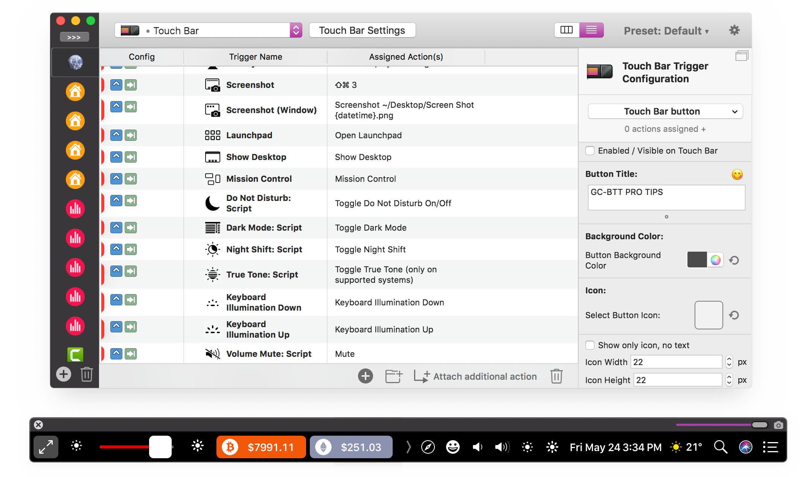
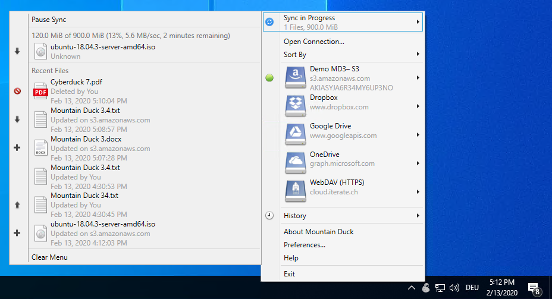
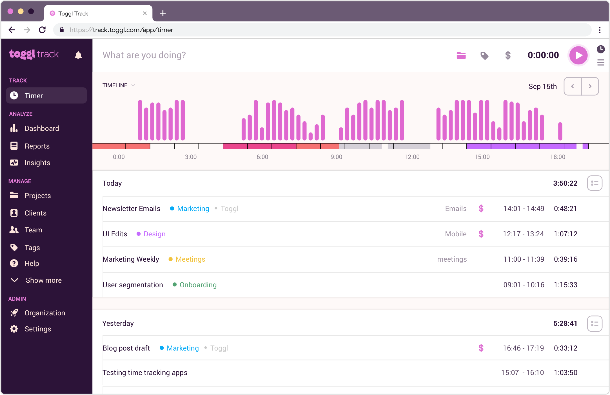
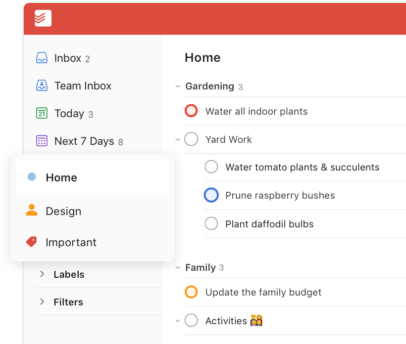
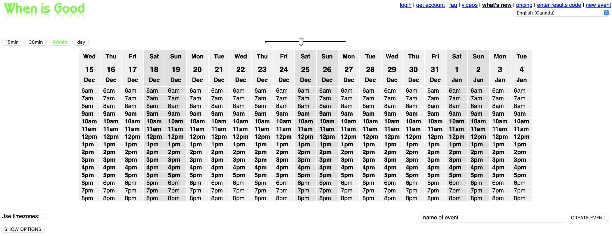
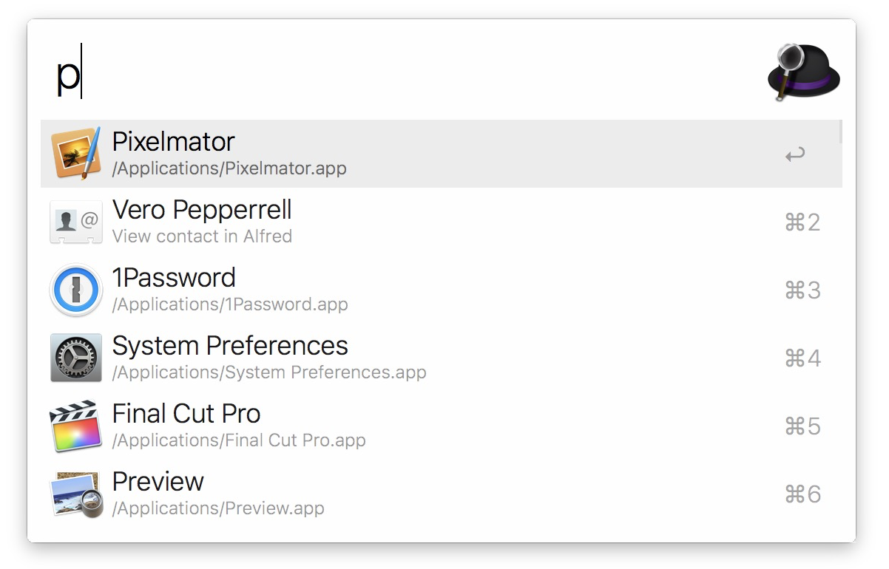

{}
On présente ici des outils qui ne sont pas conçus spécifiquement pour la recherche (ou l’académique) mais qui sont tout de même très pratiques côté productivité/usage.
{}

## Hook

> Application utile pour créer des liens URIs entre applications sous macOS.

[Hook](https://hookproductivity.com) est une application macOS qui permet de créer des URIs pour à peu près n’importe quel objet (virtuel) sur votre poste. Une URI est la version "locale" d’une URL (adresse web). Certaines applications supportent nativement les URIs, tandis que d’autres non. Hook vient centraliser tout ça et permettre de créer des liens facilement autant vers des fichiers que des courriels (dans l’application macOS Mail ou Outlook), des notes dans [Obsidian](../../recherche/gestion-information#hook), des références dans [Zotero](../../recherche/gestion-bibliographique), etc.

Par exemple, une URI associée à un item bibliographique dans Zotero (et créée avec Hook) ressemble à

```
zotero://select/items/1_QCBWBUWP
```

On peut insérer ce lien dans un autre programme qui supporte les URIs (e.g. macOS TextEdit, Obsidian, Todoist, etc.) et cliquer sur ce lien nous amène vers la référence dans Zotero.

<figure>

<figcaption>Hook.</figcaption>
</figure>

## BetterTouchTools

> Application de personnalisation de raccourcis clavier et trackpad sous macOS.

[BetterTouchTools](https://folivora.ai) est une application macOS qui permet de reconfigurer n’importe quelle combinaison de touches ou de geste du trackpad et de l’associer à toute une gamme d’actions prédéfinies (gestion des fenêtres, démarrage d’une application, etc.)

<figure>

<figcaption>BetterTouchTools.</figcaption>
</figure>

## MountainDuck

> Utilitaire de création de disques virtuels.

[MountainDuck](https://mountainduck.io) est une application disponible sur plusieurs plateformes qui permet de créer un disque local virtuel (*mount point*) associé à un serveur SSH distant, un serveur d’infonuagique (e.g. Google Drive, etc.)

Peut être utilisé pour accéder de manière distante aux fichiers présents sur la grappe de calcul.



## Toggl

> Utilitaire de comptabilisation du temps.

[Toggl](http://toggl.com) permet de comptabiliser le temps passé sur des projets.



## Todoist

> Gestionnaire de tâches.

[Todoist](http://todoist.com) est une application de gestion de tâches disponible sur plusieurs plateformes, et qui est assez bien conçue de manière générale.



## Focus

> Application pour bloquer les distractions.

[Focus](https://heyfocus.com) est une application macOS qui permet de bloquer les distractions (applications/sites web inutiles).

## whenisgood

> Application web pour planifier des rencontres.

[whenisgood](http://whenisgood.net) est une application web qui permet de comparer les disponibilités afin de planifier des rencontres.



## Alfred

> Ligne de commande en mode graphique sous macOS.

[Alfred](https://www.alfredapp.com) est une application qui permet d’invoquer une ligne de commande graphique permettant de lancer des applications, chercher des fichiers, appeler des fonctions personnalisables, etc.


