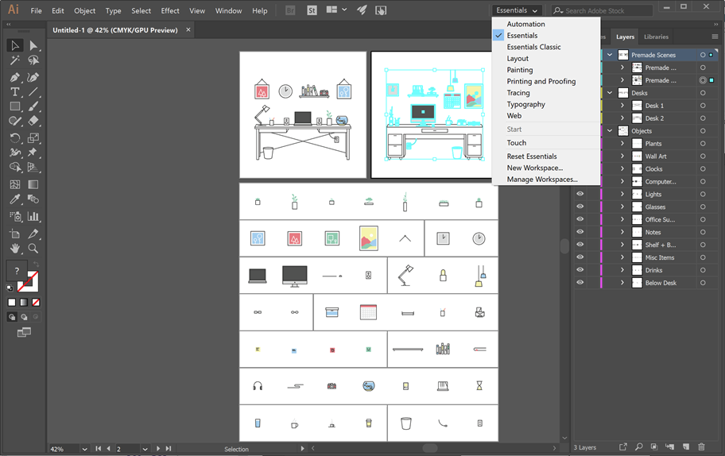
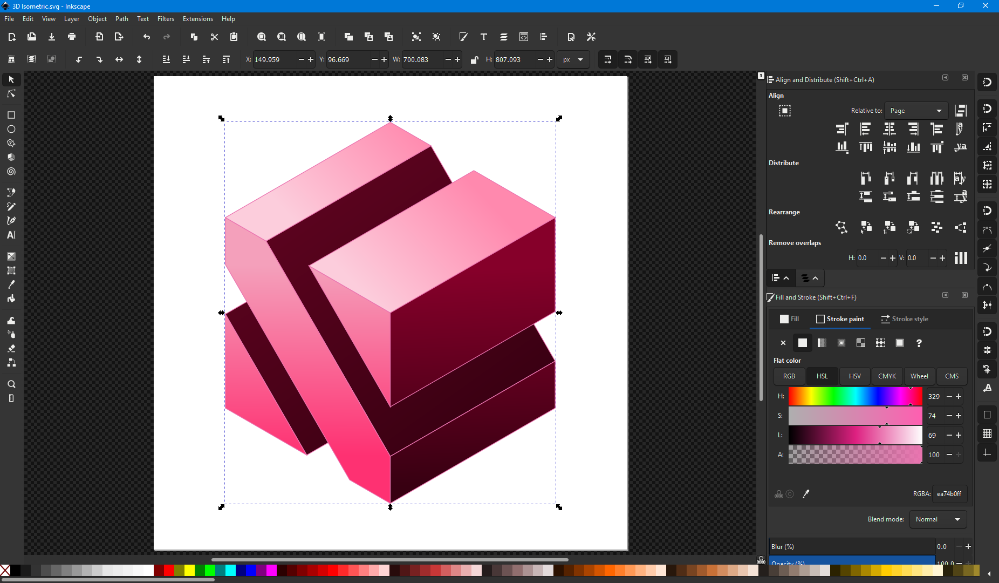
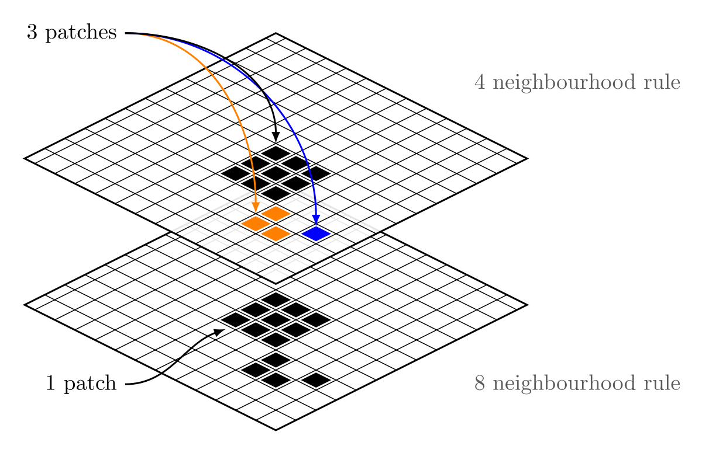

{}
On présente ici quelques options d’applications pour l’édition vectorielle. L’édition vectorielle agit sur des fichiers vectoriels (tels les PDFs et SVGs) et non sur des images matricielles (PNGs, JPGs, etc.) Permet d’obtenir des images -- dans la mesure où ceux-ci peuvent être vectorisées -- de bien meilleure qualité visuelle, et qui demeurent facilement modifiables en tout temps.
{}

## Adobe Illustrator

> Logiciel d’édition vectorielle propriétaire.

[Adobe Illustrator](https://www.adobe.com/ca/products/illustrator.html) est le nec plus ultra de l’édition vectorielle.

## Inkscape

> Logiciel d’édition vectorielle gratuit.

[Inkscape](https://inkscape.org) est le petit frère gratuit d’[Adobe Illustrator](#Adobe-Illustrator). Possède pas mal de fonctionnalités, mais à mon expérience peu stable et assez lent sous macOS malheureusement.

## tikz

> Package latex de conception vectorielle.

[Tikz](https://www.ctan.org/pkg/pgf) n’est pas un programme à proprement parler mais plutôt un package latex. Permet de programmer des diagrammes.

