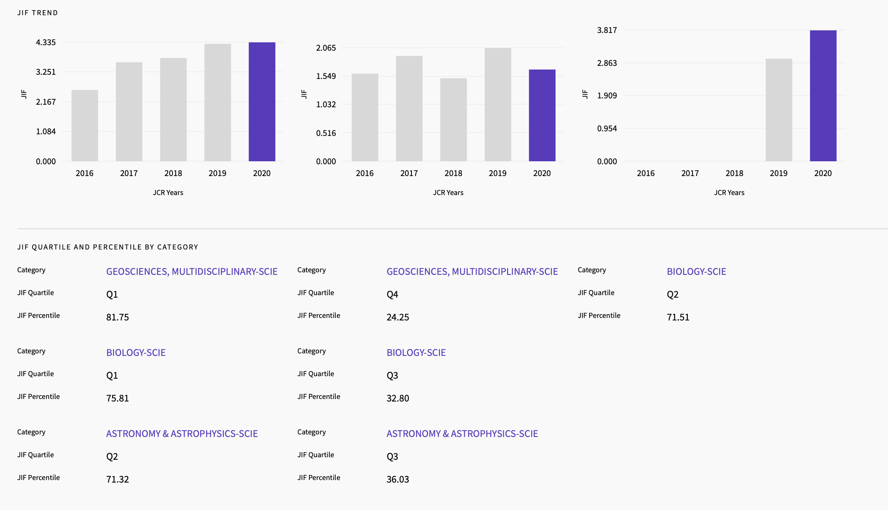

{}
On présente ici diverses ressources web pour obtenir les livres et articles, et pour évaluer la réputation des revues scientifiques.
{}

## Obtenir des articles & livres

> Comme ce site est pour l’instant public, seules les ressources *légales* y sont présentées.

[Internet Archive](https://archive.org/details/books)\
Accès à plusieurs livres libres de droits

[PretNumerique](https://montreal.pretnumerique.ca/home)\
Accès à plusieurs livres québécois en format électronique

[Bibliothèques - UdeM](https://bib.umontreal.ca/)\
Accès au site de la bibliothèque de l’UdeM

[BAnQ](https://banq.pretnumerique.ca/home)\
Accès à plusieurs livres québécois en format électronique

[BAnQ numérique](https://numerique.banq.qc.ca/ressources)\
Accès à plusieurs livres québécois en format électronique

[Scribd](https://www.scribd.com/)\
Gros foutoir de pdf où se retrouvent parfois quelques uns utiles

## Évaluer la réputation d’une revue

> Ce type de métrique est à prendre avec un grain de sel ; varie en fonction des disciplines, imperfections, etc.

[Journal Citation Report](https://jcr.clarivate.com/)\
*La* référence pour comparer différents journaux entre eux.

<figure>

<figcaption>Journal Citation Report.</figcaption>
</figure>