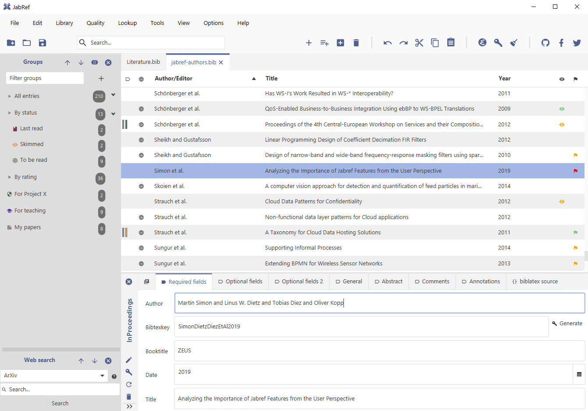

{}
Il existe une grande variété d’outils de gestion bibliographique -- on présente ci-dessous trois des plus populaires.
{}

## Zotero

> Application multi-plateformes et gratuite de gestion bibliographique.

[Zotero](https://www.zotero.org) est un logiciel de gestion bibliographique Open Source et gratuit qui jouit d’une grande popularité et d’une équipe de développement dynamique. Disponible sur plusieurs plateformes (incluant e.g. iOS), le logiciel est extrêmement fiable et possède toute une panoplie de "plug-ins" développés par la communauté.

Il est également possible de payer pour la synchronisation de notre bibliographie entre appareils, et de stocker les fichiers PDFs sur leur serveur. Une interface web est également disponible.

### Plug-ins utiles

* **Better BibTex** : permet d’exporter des références sous format BibTex pour utilisation avec LaTeX
* **PubPeer** : permet de voir si un article comporte des commentaires sur [PubPeer](https://pubpeer.com)
* **scite** : comptabilise les références à un article
* **zotxt** : utilisé notamment par [Hook](../../outils/autres-outils#hook)
* **Zutilo** : permet toute une gamme de fonctions avancées, comme copier des liens URIs, etc.

<figure>

<figcaption>Zotero.</figcaption>
</figure>

## JabRef

> Application multi-plateformes et gratuite de gestion bibliographique.

[JabRef](https://www.jabref.org) est un autre logiciel de gestion bibliographique qui possède de nombreuses fonctionnalités. Malheureusement, je n’ai jamais réussi à le faire fonctionner correctement sous macOS donc difficile d’en parler davantage!

<figure>

<figcaption>Jabref.</figcaption>
</figure>

## Mendeley

> Application multi-plateformes de gestion bibliographique propriétaire de l’éditeur Elsevier.

[Mendeley](https://www.mendeley.com) est un logiciel de gestion bibliographique propriétaire de la compagnie d’édition Elsevier. Également disponible sur plusieurs plateformes. Je ne l’ai que très peu utilisé, donc je ne peux pas trop m’étendre à son sujet!

<figure>

<figcaption>Mendeley.</figcaption>
</figure>
