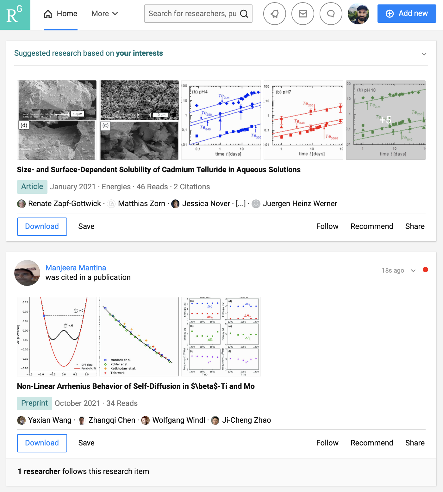
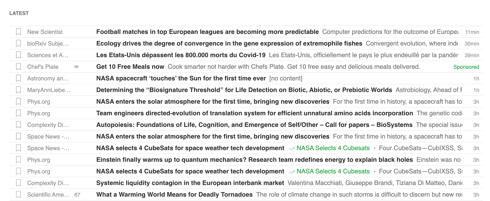

{}
On présente ci-dessous quelques outils pour se tenir au courant de la sortie de nouveaux articles dans un champ de recherche donné, et des annonces de colloques/conférences, postes disponibles, etc.
{}

## ResearchGate

> Réseau "social" où on peut suivre des chercheurs individuels, si ceux-ci y ajoutent leurs publications.

Le site [ResearchGate](http://researchgate.net) est un réseau social où on peut suivre des chercheurs, se créer un profil académique, et y entrer nos publications. Ce ne sont pas tous les chercheurs qui y ont un compte mais le site est néanmoins relativement populaire (du moins, dans mon domaine). Cela dit, ce ne sont pas tous les chercheurs qui y déposent leurs articles, et l’interface n’est pas tellement efficace pour faire une veille de la recherche de manière générale. Solution complémentaire dans mon cas.

<figure>

<figcaption>ResearchGate.</figcaption>
</figure>

## Feedly

> Lecteur RSS qui permet d’être mis à jour en temps réel de la sortie de nouvelles publications (de manière générale, pas seulement scientifiques).

[Feedly](https://feedly.com) est une application web qui agit comme aggrégateur/lecteur RSS. Le RSS est un (vieux!) protocole web basé sur le langage XML qui permet d’entrer des sources dans un lecteur, et à chaque fois que notre source publie un nouvel article/blog/etc. notre lecteur affichera une mise à jour. Par exemple, on peut créer une nouvelle entrée dans Feedly pour [l’un des fils RSS de la revue Scientific American](https://www.scientificamerican.com/page/sitemap/topics/), et au fur et à mesure que S.A. publie de nouveaux articles, une nouvelle entrée apparaît dans notre lecteur RSS avec un court résumé ainsi qu’un lien vers l’article.

Un lecteur RSS est un moyen extrêmement efficace de passer en revue une grande quantité d’articles sans avoir nécessairement à visiter les pages web individuelles de chaque publication. La grande majorité des revues scientifiques et blogues possèdent des fils RSS auxquels il est possible de souscrire.

<figure>

<figcaption>Feedly.</figcaption>
</figure>

## Twitter

> Ressource parfois utile pour suivre des chercheurs et groupes de recherche précis.

Le réseau social [Twitter](https://twitter.com/) est particulièrement populaire auprès de la communauté scientifique. Le désavantage, c’est que vous allez autant y voir passer des *memes* de chats que des publications scientifiques. Cela étant dit, peut être pratique pour découvrir de nouveaux chercheurs, publiciser votre recherche et interagir directement avec les auteurs de publications de manière informelle. Plusieurs autres contenus pertinents y sont publiés également -- tutoriels, références à de nouveaux outils, etc.

Twitter peut rapidement devenir une grosse perte de temps. À utiliser intelligemment.

## Listes de courriel

> Beaucoup de journaux, groupes ou instituts de recherche offrent des listes de courriel.

Plusieurs université, départements, groupes de recherche et autres regroupements/organismes déploient des listes de diffusions courriel. Utile pour se garder informé des conférences à venir, nouveaux articles publiés, actualités scientifiques et offres d’emploi.